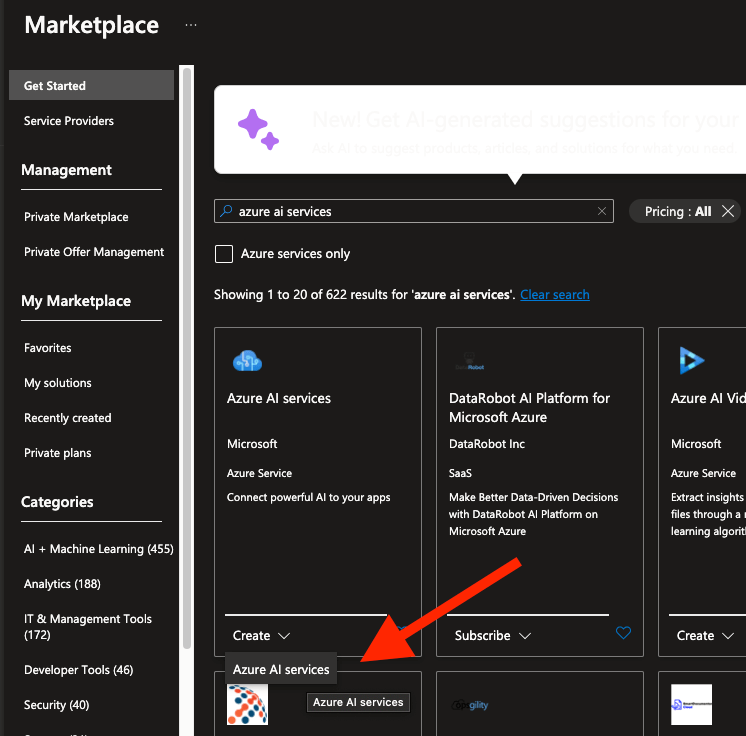
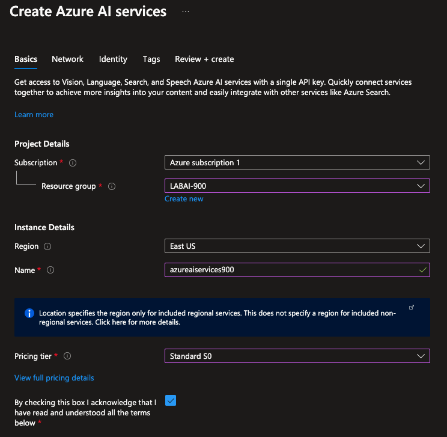
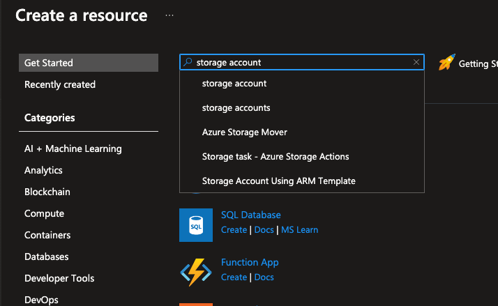

# Repo: Azure Cognitive Search: Utilizando AI Search para indexação e consulta de Dados
### Objetivo

Repositório criado para entregar o projeto final da etapa: Azure Cognitive Search - Utilizando AI Search para indexação e consulta de Dados.

Três **recursos** são importantes para esse experimento:

- Azure AI Search
- Azure AI services
- Storage account

# Requerimentos do projeto
### Como Entregar esse projeto?

Chegou a hora de você construir um portfólio ainda mais rico e impressionar futuros recrutadores, para isso é sempre importante mostrar os resultados do seu esforço e como você os obteve deixando claro o seu racional, para isso faça da seguinte maneira:

1. Crie um novo repositório no github com um nome a sua preferência
2. Crie um arquivo readme.md descrevendo o passo a passo para se configurar uma pesquisa, assim como seus insights, possibilidades de ferramentas que se beneficiam com esse tipo de ferramenta e aprendizados adquiridos durante o processo.
3. Compartilhe conosco o link desse repositório através do botão 'entregar projeto'

# Link útil

1. https://aka.ms/ai900-ai-search

# Crie um arquivo readme.md descrevendo o passo a passo para se configurar uma pesquisa, assim como seus insights, possibilidades de ferramentas que se beneficiam com esse tipo de ferramenta e aprendizados adquiridos durante o processo.

⭐️ A minha sugestão é deixar toda a plataforma em inglês ⭐️

### Passo a passo para se configurar uma pesquisa

* Criar um recurso Azure AI Search
* Criar um recurso Azure AI services
* Criar um Storage Account
* Adicionar documentos ao Azure Storage
* Indexar os documentos
* Consultar o índice
* Revisar o knowledge store

#### Crie um recuros Azure AI Search

1. Esteja logado no [Portal Azure](https://portal.azure.com).
2. Clique em **+ Create a resource**, procure e crie um **Azure AI Search** com as configurações abaixo:

	* **Subscription**: Your Azure subscription.
	* **Resource group**: Select or create a resource group with a unique name.
	* **Service name**: A unique name.
	* **Location**: Choose any available region.
	* **Pricing tier**: Basic.

| 2.1 | 2.2 | 2.3 | 2.4 |
|:--------:|:--------:|:--------:|:--------:|
|||||

#### Criar um recurso Azure AI services

3. Retorne ao início do [Portal Azure](https://portal.azure.com) e clique novamente em **+ Create a resource**, procure e crie um **Azure AI services** com as configurações abaixo:

	* **Subscription**: Your Azure subscription.
	* **Resource group**: The same resource group as your Azure AI Search resource.
	* **Region**: The same location as your Azure AI Search resource.
	* **Name**: A unique name.
	* **Pricing tier**: Standard S0.
	* **By checking this box I acknowledge that I have read and understood all the terms below**: Selected.

| 3.1 | 3.2 | 3.3 |
|:--------:|:--------:|:--------:|
||||

#### Criar um Storage Account

4. Retorne ao início do [Portal Azure](https://portal.azure.com) e clique novamente em **+ Create a resource**, procure e crie um **storage account** com as configurações abaixo:

	* **Subscription**: Your Azure subscription.
	* **Resource group**: The same resource group as your Azure AI Search and Azure AI services resources.
	* **Storage account name**: A unique name.
	* **Location**: Choose any available location.
	* **Performance**: Standard.
	* **Redundancy**: Locally redundant storage (LRS).

| 4.1 | 4.2 | 4.3 |
|:--------:|:--------:|:--------:|
||||

### Insights

### Possibilidades de ferramentas que se beneficiam com esse tipo de ferramenta

### Aprendizados adquiridos
