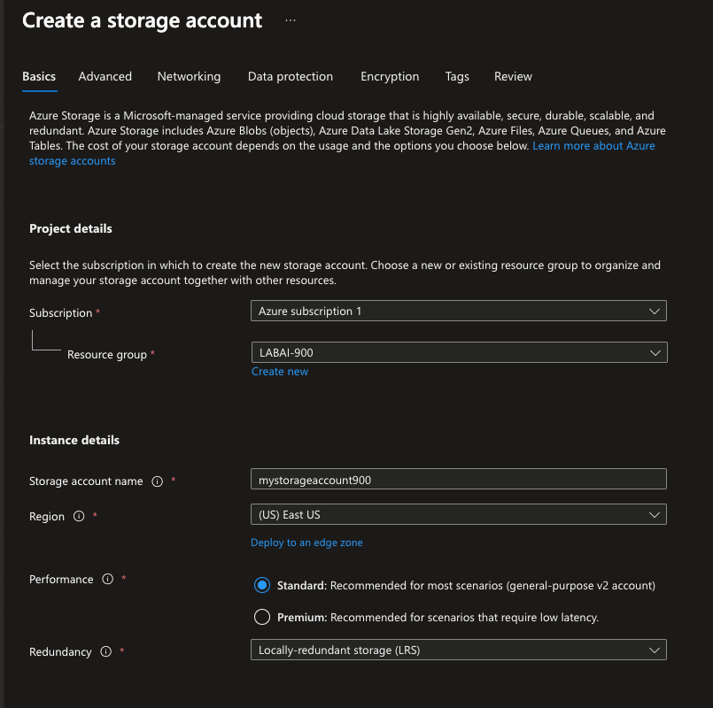
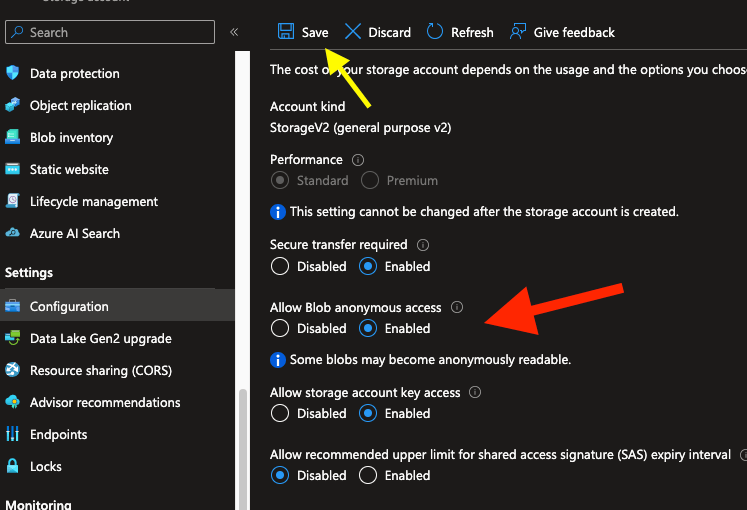
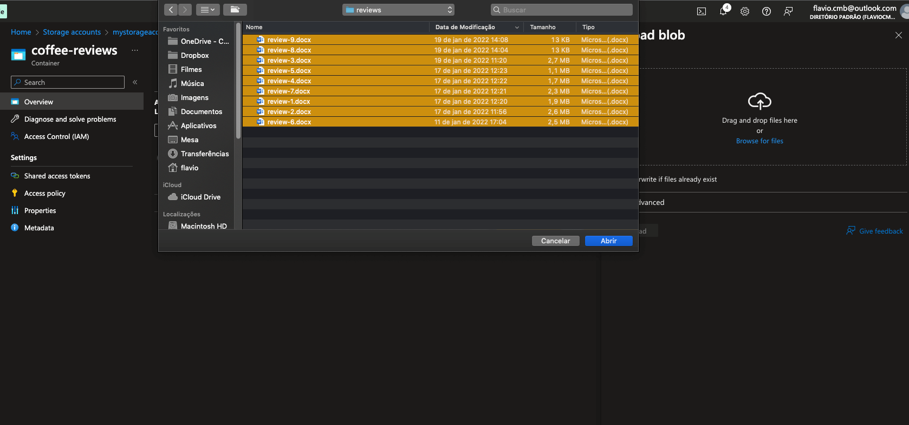
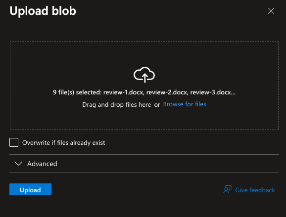
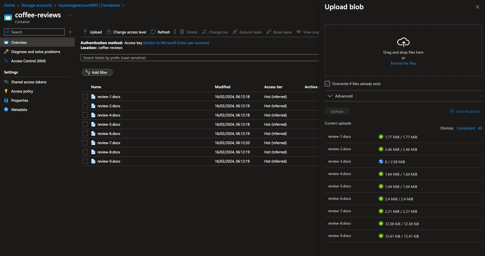

# Repo: Azure Cognitive Search: Utilizando AI Search para indexação e consulta de Dados
### Objetivo

Repositório criado para entregar o projeto final da etapa: Azure Cognitive Search - Utilizando AI Search para indexação e consulta de Dados.

Três **recursos** são importantes para esse experimento:

- Azure AI Search
- Azure AI services
- Storage account

# Requerimentos do projeto
### Como Entregar esse projeto?

Chegou a hora de você construir um portfólio ainda mais rico e impressionar futuros recrutadores, para isso é sempre importante mostrar os resultados do seu esforço e como você os obteve deixando claro o seu racional, para isso faça da seguinte maneira:

1. Crie um novo repositório no github com um nome a sua preferência
2. Crie um arquivo readme.md descrevendo o passo a passo para se configurar uma pesquisa, assim como seus insights, possibilidades de ferramentas que se beneficiam com esse tipo de ferramenta e aprendizados adquiridos durante o processo.
3. Compartilhe conosco o link desse repositório através do botão 'entregar projeto'

# Link útil

1. https://aka.ms/ai900-ai-search

# Crie um arquivo readme.md descrevendo o passo a passo para se configurar uma pesquisa, assim como seus insights, possibilidades de ferramentas que se beneficiam com esse tipo de ferramenta e aprendizados adquiridos durante o processo.

⭐️ A minha sugestão é deixar toda a plataforma em inglês ⭐️

### Passo a passo para se configurar uma pesquisa

* Criar um recurso Azure AI Search
* Criar um recurso Azure AI services
* Criar um Storage Account
* Adicionar documentos ao Azure Storage
* Indexar os documentos
* Consultar o índice
* Revisar o knowledge store

#### Crie um recuros Azure AI Search

1. Esteja logado no [Portal Azure](https://portal.azure.com).
2. Clique em **+ Create a resource**, procure e crie um **Azure AI Search** com as configurações abaixo:

	* **Subscription**: Your Azure subscription.
	* **Resource group**: Select or create a resource group with a unique name.
	* **Service name**: A unique name.
	* **Location**: Choose any available region.
	* **Pricing tier**: Basic.

| 2.1 | 2.2 | 2.3 | 2.4 |
|:--------:|:--------:|:--------:|:--------:|
|||||

#### Criar um recurso Azure AI services

3. Retorne ao início do [Portal Azure](https://portal.azure.com) e clique novamente em **+ Create a resource**, procure e crie um **Azure AI services** com as configurações abaixo:

	* **Subscription**: Your Azure subscription.
	* **Resource group**: The same resource group as your Azure AI Search resource.
	* **Region**: The same location as your Azure AI Search resource.
	* **Name**: A unique name.
	* **Pricing tier**: Standard S0.
	* **By checking this box I acknowledge that I have read and understood all the terms below**: Selected.

| 3.1 | 3.2 | 3.3 |
|:--------:|:--------:|:--------:|
||||

#### Criar um Storage Account

4. Retorne ao início do [Portal Azure](https://portal.azure.com) e clique novamente em **+ Create a resource**, procure e crie um **storage account** com as configurações abaixo:

	* **Subscription**: Your Azure subscription.
	* **Resource group**: The same resource group as your Azure AI Search and Azure AI services resources.
	* **Storage account name**: A unique name.
	* **Location**: Choose any available location.
	* **Performance**: Standard.
	* **Redundancy**: Locally redundant storage (LRS).

| 4.1 | 4.2 | 4.3 |
|:--------:|:--------:|:--------:|
||||

5. Após criar um **storage account**, no menu lateral esquerdo, acesse as configurações do seu storage account e altere a opção **Allow Blob anonymous access** para **Enabled** e salve. ⚠️

| 5.1 | 5.2 |
|:--------:|:--------:|
|||

#### Adicionar documentos ao Azure Storage

6. Dentro do seu recurso **Azure Storage Account**, no menu lateral esquerdo, acesse **Containers**, selecione **+ Container**. Vai abrir um menu lateral à direita. Preencha as informações como fornecido abaixo:

* **Name**: coffee-reviews.
* **Public access level**: Container (anonymous read access for containers and blobs).
* **Advanced**: no changes.

| 6.1 | 6.2 |
|:--------:|:--------:|
|||

7. Em uma nova janela do seu navegador, acesse esse [link](https://aka.ms/mslearn-coffee-reviews) para fazer o download dos arquivos de exemplo.

8. Ainda na sessão de **Containers**, acesse o container recém criado **coffee-reviews** e clique em **Upload**. Uma janela à direita se abrirá e você deverá selecionar os arquivos baixados e descompactados do passo anterior no seu computador.

| 8.1 | 8.2 | 8.3 | 8.4 |
|:--------:|:--------:|:--------:|:--------:|
|||||

9. Após isso, clique em Upload, dessa janela, para adicionar os documentos com as opiniões dos clientes para o container.

| 9.1 | 9.2 |
|:--------:|:--------:|
|||

#### Indexar os documentos

Depois de armazenar os documentos, você poderá usar o **Azure AI Search** para extrair insights dos documentos. O portal do Azure fornece um *Import data wizard*. Com esse wizard, você pode criar automaticamente um index (índice) e um indexer (indexador) para fontes de dados suportadas. Você usará o wizard para criar um index e importar seus documentos de opiniões do armazenamento para o index do **Azure AI Search**.

10. No [Portal Azure](https://portal.azure.com), navegue até o recurso criado **Azure AI Search** e selecione o botão **Import data**.

| 10.1 |
|:--------:|
||

11. Na guia **Connect to your data**, observe a lista em drop-down **Data Source**, selecione **Azure Blob Storage**. Complete as informações como mostrado abaixo:

	* **Data Source**: Azure Blob Storage
	* **Data source name**: coffee-customer-data
	* **Data to extract**: Content and metadata
	* **Parsing mode**: Default
	* **Connection string**: Select Choose an existing connection. Select your storage account, select the coffee-reviews container, and then click Select.
	* **Managed identity authentication**: None
	* **Container name**: this setting is auto-populated after you choose an existing connection.
	* **Blob folder**: Leave this blank.
	* **Description**: Reviews for Fourth Coffee shops.

| 11.1 | 11.2 | 11.3 | 11.4 |
|:--------:|:--------:|:--------:|:--------:|
|||||

12. Clique em **Next: Add cognitive skills (Optional)**.

| 12.1 |
|:--------:|
||

13. Na seção **Attach Cognitive Services**, selecione o seu recuros Azure AI services.

| 13.1 |
|:--------:|
||

14. Na seção **Add enrichments**:

	* Change the Skillset name to **coffee-skillset**.
	* Select the checkbox **Enable OCR and merge all text into merged_content field**.
	* Ensure that the Source data field is set to **merged_content**.
	* Change the Enrichment granularity level to **Pages (5000 character chunks)**.
	* Don’t select *Enable incremental enrichment*.
	* Select the following enriched fields: ⚠️ **(ver imagem 14.2)**.

| 14.1 | 14.2 |
|:--------:|:--------:|
|||

15. Na seção **Save enrichments to a knowledge store**, selecione:

	* Image projections
		* ⚠️ Uma mensagem de alerta aparecerá em vermelho (ver imagem 15.2) perguntando sobre *Storage Account Connection String*, siga esses passos:
			1. Select **Choose an existing connection**. 
			2. Choose the storage account you created earlier.
			3. Click on **+ Container** to create a new container called knowledge-store with the privacy level set to Private, and select Create.
			4. Select the knowledge-store container, and then click Select at the bottom of the screen.
	* Documents
	* Pages
		* Key phrases
		* Entities
	* Image details
		* Image references

| 15.1 | 15.2 | 15.3 | 15.4 | 15.5 | 15.6 |
|:--------:|:--------:|:--------:|:--------:|:--------:|:--------:|
|||||||

16. Ainda na seção **Save enrichments to a knowledge store**, selecione **Azure blob projections: Document**. Aparecerá o container recém criado knowledge-store, não altere esse nome mostrado.

| 16.1 |
|:--------:|
||

17. Observe todas as configurações realizadas e selecione **Next: Customize target index**.

| 17.1 |
|:--------:|
||

18. Na etapa seguinte, altere o **Index name** para **coffee-index**.

### Insights

### Possibilidades de ferramentas que se beneficiam com esse tipo de ferramenta

### Aprendizados adquiridos
